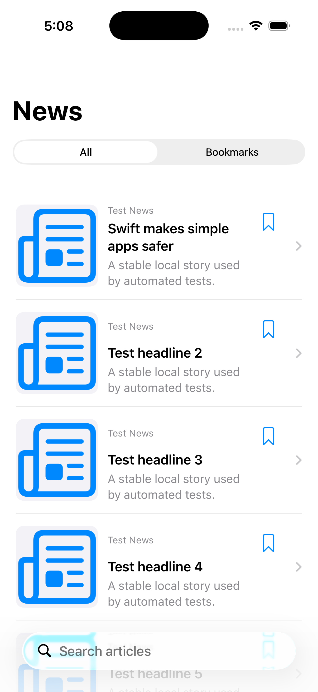

# Mac verification evidence

This folder answers a simple question: “Did the project really build and run on
a Mac, or are these only untested source files?” The answer for the verified
commit below is yes—it built, launched, and passed every test that Xcode ran.

## Exact environment

- Verified application commit: `f08a9a57b8963a5ac0790d455062f9b8d0c713ba`
- Mac: Apple silicon, macOS 26.6.2 (25G83)
- Xcode: 26.6 (17F113)
- Simulator: iPhone 17 Pro, iOS 26.5 (23F77)
- App identifier: `in.sachinserver.News-App`

The machine-readable source is [Environment.txt](Environment.txt).

## Build and test result

- The full shared-scheme test run passed 17 of 17 tests.
- There were zero failures, zero skipped tests, and zero expected failures.
- The passing set includes unit tests, stubbed-URLSession integration tests,
  in-memory Core Data tests, critical XCUITest journeys, the Apple accessibility
  audit, launch performance, and scrolling performance.
- `xcodebuild analyze` passed.
- The Release simulator build passed and produced a 1,478,656-byte `.app` bundle.
- The Release app was installed and launched successfully in the simulator.

The authoritative Xcode result summary is
[FullTestSummary.json](FullTestSummary.json). The running Release build is shown
below; UI-test fixture stories are intentional so the screenshot is repeatable
and does not expose an API key.

## Live API smoke test

Commit `56aba31` was also built after a newly rotated key was supplied through
the ignored `.env` workflow. The Debug app was installed and launched with no
`--ui-testing` argument, so `AppEnvironment` selected `DefaultNewsRepository`
instead of `FixtureNewsRepository`. The All feed then displayed NewsAPI stories
from publishers including BBC News and Axios, together with their remote images.

The key value was never printed or committed. The temporary `.env` and generated
xcconfig copies were removed from the Mac checkout after the build; only the
installed development app contains the requested embedded value.

## Performance result without résumé exaggeration

`XCTApplicationLaunchMetric` produced five first-responsive-frame durations:
2.626 s, 3.988 s, 2.939 s, 2.648 s, and 2.249 s. Their median is 2.648 s. With
only five samples, the maximum is recorded instead of pretending it is a strong
statistical p95.

The scrolling signpost produced five drag/deceleration durations: 2.583 s,
2.570 s, 2.568 s, 2.466 s, and 2.567 s. Their median is 2.568 s. This value is
gesture duration, not a claim of “zero hitches.” The untouched source values are
in [FullPerformanceMetrics.json](FullPerformanceMetrics.json).

The repeatable Instruments workflow produced:

- a Time Profiler launch trace manifest: [Launch-toc.xml](Launch-toc.xml);
- a Time Profiler scrolling trace manifest: [Scrolling-toc.xml](Scrolling-toc.xml);
- a Network trace manifest containing CFNetwork task/transaction tables:
  [Networking-toc.xml](Networking-toc.xml);
- a simulator leak scan reporting 0 leaked allocations and a 21.9 MiB footprint,
  with a 22.8 MiB peak: [MemoryLeaks.txt](MemoryLeaks.txt).

The leak tool warned that simulator process security limited it to readable
memory. Therefore this is useful regression evidence, not proof that every
possible device-only leak is absent. A final physical-device Instruments pass
is still appropriate before quoting device performance numbers.

## What still depends on private accounts

Source implementation is complete, but no repository can manufacture these
private external credentials:

- the previously exposed NewsAPI key must be revoked and replaced by its owner;
- the previously exposed GitHub personal access token must be revoked by its
  owner;
- a live-news run needs the replacement `NEWS_API_KEY` supplied outside Git;
- TestFlight needs the distribution certificate, provisioning profile, and App
  Store Connect issuer/key values listed in `docs/TESTFLIGHT.md`;
- GitHub Actions is blocked before checkout because GitHub reports that the
  account is locked due to a billing issue; the confirming run is
  [iOS CI #8](https://github.com/sachin6174/News-App/actions/runs/33573349155).

Those are account operations, not missing Swift functions. Until they are done,
the accurate claim is “Mac-verified, release-automation-ready,” not “published to
TestFlight.”
